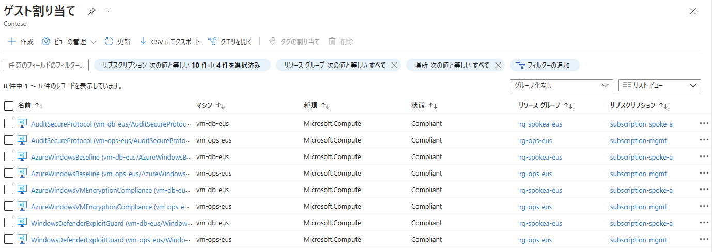

# ★ [Windows OS] GC ルールの割り当て

Windows OS に対して、適切な GC ルールを設定するための作業を行います。

- GC エージェントは、割り当てられたルールを用いて、仮想マシンの構成設定チェックを行います。Windows OS の場合は、通常、以下の 4 つのルールが割り当てられます。
  - AuditSecureProtocol (TLS 1.2 以外のプロトコルが利用不可になっているかを確認)
  - AzureWindowsBaseline (CSB によるハードニングを確認)
  - AzureWindowsVMEncryptionCompliance (BitLocker 暗号化(ADE) を確認)
  - WindowsDefenderExploitGuard (Windows Defender Exploit Guard が有効かを確認)
- これらのルール割り当ての状態は、ゲスト割り当て画面から確認できます。
  -   
- ルールが割り当てられるかどうかは、GC のセットアップ方法により変わります。
  - MDfC の GC エージェント自動プロビジョニング機能を利用した場合にはこれらの 4 つのルール割り当ても行われます。
  - 一方、コマンドラインから手動で GC エージェントをインストールした場合には、ルール割り当ては自動では行われません。（エージェントが VM にインストールされるだけ）
- 後者のようになった場合には、ルールを手作業で割り当てる必要があります。これを行うのが本スクリプトです。
  - AzureWindowsBaseline の割り当ては[すでに示しています](./05_03_%E2%98%85%20%5BWindows%20OS%5D%20CSB%20%E9%81%A9%E7%94%A8.md)ので、残り 3 つのルール割り当てを行います。

```bash
# CSB の再適用の場合は CSB 適用スクリプトをもう一度流す
# 以下はそれ以外の GC ルールが外れてしまった場合にそれらを再設定するもの
# （外してから付け直すため、まだついていなかった場合にはエラーが出るが無視してよい）
 
# vm-web, db に対して適用する場合は以下
#TEMP_TARGET_SUBSCRIPTION_IDS=$SUBSCRIPTION_ID_SPOKE_A
#if ${FLAG_USE_SOD} ; then az account clear ; az login -u "user_spokea_dev@${PRIMARY_DOMAIN_NAME}" -p "${ADMIN_PASSWORD}" ; fi
 
# vm-ops に適用する場合は以下
#TEMP_TARGET_SUBSCRIPTION_IDS=$SUBSCRIPTION_ID_MGMT
#if ${FLAG_USE_SOD} ; then az account clear ; az login -u "user_plat_dev@${PRIMARY_DOMAIN_NAME}" -p "${ADMIN_PASSWORD}" ; fi
 
for TEMP_SUBSCRIPTION_ID in $TEMP_TARGET_SUBSCRIPTION_IDS; do
echo "Setting GC... ${TEMP_SUBSCRIPTION_ID}"
az account set -s "${TEMP_SUBSCRIPTION_ID}"
 
for i in ${VDC_NUMBERS}; do
  TEMP_LOCATION_NAME=${LOCATION_NAMES[$i]}
  TEMP_LOCATION_PREFIX=${LOCATION_PREFIXS[$i]}
 
for TEMP_RG_NAME in $(az group list --query "[?location == '${TEMP_LOCATION_NAME}' ].name" -o tsv); do
for TEMP_VM_NAME in $(az vm list --resource-group ${TEMP_RG_NAME} --query "[?storageProfile.osDisk.osType=='Windows'].name" -o tsv); do
 
# AuditSecureProtocol
TEMP_GC_ASSIGNMENT_NAME="AuditSecureProtocol"
TEMP_URI="/subscriptions/${TEMP_SUBSCRIPTION_ID}/resourceGroups/${TEMP_RG_NAME}/providers/Microsoft.Compute/virtualMachines/${TEMP_VM_NAME}/providers/Microsoft.GuestConfiguration/guestConfigurationAssignments/${TEMP_GC_ASSIGNMENT_NAME}?api-version=2022-01-25"
echo "Deleting existing GC ${TEMP_GC_ASSIGNMENT_NAME} rule on ${TEMP_VM_NAME}"
az rest --uri ${TEMP_URI} --method DELETE
cat <<EOF > tmp.json
{
  "\$schema": " https://schema.management.azure.com/schemas/2019-04-01/deploymentTemplate.json#",
  "contentVersion": "1.0.0.0",
  "resources": [
    {
      "apiVersion": "2022-01-25",
      "type": "Microsoft.Compute/virtualMachines/providers/guestConfigurationAssignments",
      "name": "${TEMP_VM_NAME}/Microsoft.GuestConfiguration/${TEMP_GC_ASSIGNMENT_NAME}",
      "location": "${TEMP_LOCATION_NAME}",
      "properties": {
        "guestConfiguration": {
          "name": "${TEMP_GC_ASSIGNMENT_NAME}",
          "version": "1.*",
          "assignmentType": null,
          "configurationParameter": [
            {
              "name": "[SecureWebServer]s1;MinimumTLSVersion",
              "value": "1.2"
            }
          ],
          "configurationSetting": {
            "actionAfterReboot": "",
            "allowModuleOverwrite": false,
            "configurationMode": "MonitorOnly",
            "configurationModeFrequencyMins": 15,
            "rebootIfNeeded": true,
            "refreshFrequencyMins": 5
          }
        }
      }
    }
  ]
}
EOF
echo "Creating GC ${TEMP_GC_ASSIGNMENT_NAME} rule on ${TEMP_VM_NAME}"
az deployment group create --name "${TEMP_VM_NAME}-${TEMP_GC_ASSIGNMENT_NAME}" --resource-group ${TEMP_RG_NAME} --template-file tmp.json
 
# AzureWindowsVMEncryptionCompliance
TEMP_GC_ASSIGNMENT_NAME="AzureWindowsVMEncryptionCompliance"
TEMP_URI="/subscriptions/${TEMP_SUBSCRIPTION_ID}/resourceGroups/${TEMP_RG_NAME}/providers/Microsoft.Compute/virtualMachines/${TEMP_VM_NAME}/providers/Microsoft.GuestConfiguration/guestConfigurationAssignments/${TEMP_GC_ASSIGNMENT_NAME}?api-version=2022-01-25"
echo "Deleting existing GC ${TEMP_GC_ASSIGNMENT_NAME} rule on ${TEMP_VM_NAME}"
az rest --uri ${TEMP_URI} --method DELETE
cat <<EOF > tmp.json
{
  "\$schema": " https://schema.management.azure.com/schemas/2019-04-01/deploymentTemplate.json#",
  "contentVersion": "1.0.0.0",
  "resources": [
    {
      "apiVersion": "2022-01-25",
      "type": "Microsoft.Compute/virtualMachines/providers/guestConfigurationAssignments",
      "name": "${TEMP_VM_NAME}/Microsoft.GuestConfiguration/${TEMP_GC_ASSIGNMENT_NAME}",
      "location": "${TEMP_LOCATION_NAME}",
      "properties": {
        "guestConfiguration": {
          "name": "${TEMP_GC_ASSIGNMENT_NAME}",
          "version": "1.*",
          "assignmentType": null,
          "configurationParameter": [],
          "configurationSetting": {
            "actionAfterReboot": "",
            "allowModuleOverwrite": false,
            "configurationMode": "MonitorOnly",
            "configurationModeFrequencyMins": 15,
            "rebootIfNeeded": true,
            "refreshFrequencyMins": 5
          }
        }
      }
    }
  ]
}
EOF
echo "Creating GC ${TEMP_GC_ASSIGNMENT_NAME} rule on ${TEMP_VM_NAME}"
az deployment group create --name "${TEMP_VM_NAME}-${TEMP_GC_ASSIGNMENT_NAME}" --resource-group ${TEMP_RG_NAME} --template-file tmp.json
 
# WindowsDefenderExploitGuard
TEMP_GC_ASSIGNMENT_NAME="WindowsDefenderExploitGuard"
TEMP_URI="/subscriptions/${TEMP_SUBSCRIPTION_ID}/resourceGroups/${TEMP_RG_NAME}/providers/Microsoft.Compute/virtualMachines/${TEMP_VM_NAME}/providers/Microsoft.GuestConfiguration/guestConfigurationAssignments/${TEMP_GC_ASSIGNMENT_NAME}?api-version=2022-01-25"
echo "Deleting existing GC ${TEMP_GC_ASSIGNMENT_NAME} rule on ${TEMP_VM_NAME}"
az rest --uri ${TEMP_URI} --method DELETE
cat <<EOF > tmp.json
{
  "\$schema": " https://schema.management.azure.com/schemas/2019-04-01/deploymentTemplate.json#",
  "contentVersion": "1.0.0.0",
  "resources": [
    {
      "apiVersion": "2022-01-25",
      "type": "Microsoft.Compute/virtualMachines/providers/guestConfigurationAssignments",
      "name": "${TEMP_VM_NAME}/Microsoft.GuestConfiguration/${TEMP_GC_ASSIGNMENT_NAME}",
      "location": "${TEMP_LOCATION_NAME}",
      "properties": {
        "guestConfiguration": {
          "name": "${TEMP_GC_ASSIGNMENT_NAME}",
          "version": "1.*",
          "assignmentType": null,
          "configurationParameter": [
            {
              "name": "[WindowsDefenderExploitGuard]WindowsDefenderExploitGuard1;NotAvailableMachineState",
              "value": "Compliant"
            }
          ],
          "configurationSetting": {
            "actionAfterReboot": "",
            "allowModuleOverwrite": false,
            "configurationMode": "MonitorOnly",
            "configurationModeFrequencyMins": 15,
            "rebootIfNeeded": true,
            "refreshFrequencyMins": 5
          }
        }
      }
    }
  ]
}
EOF
echo "Creating GC ${TEMP_GC_ASSIGNMENT_NAME} rule on ${TEMP_VM_NAME}"
az deployment group create --name "${TEMP_VM_NAME}-${TEMP_GC_ASSIGNMENT_NAME}" --resource-group ${TEMP_RG_NAME} --template-file tmp.json
 
# VM を再起動
echo "Restarting ${TEMP_VM_NAME}"
az vm restart --force --resource-group ${TEMP_RG_NAME} --name ${TEMP_VM_NAME} --no-wait
 
done # TEMP_VM_NAME
done # TEMP_RG_NAME
done # TEMP_LOCATION_NAME
done # TEMP_SUBSCRIPTION_ID

# 手作業で 1 台の VM に割り当てたい場合は下記。
#TEMP_GC_ASSIGNMENT_NAME="AuditSecureProtocol"
#TEMP_GC_ASSIGNMENT_NAME="AzureWindowsVMEncryptionCompliance"
#TEMP_GC_ASSIGNMENT_NAME="WindowsDefenderExploitGuard"
#TEMP_URI="/subscriptions/${SUBSCRIPTION_ID_MGMT}/resourceGroups/rg-ops-eus/providers/Microsoft.Compute/virtualMachines/vm-ops-eus/providers/Microsoft.GuestConfiguration/guestConfigurationAssignments/${TEMP_GC_ASSIGNMENT_NAME}?api-version=2022-01-25"
#az rest --uri ${TEMP_URI} --method GET

```
