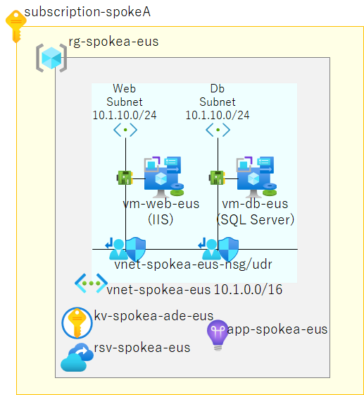
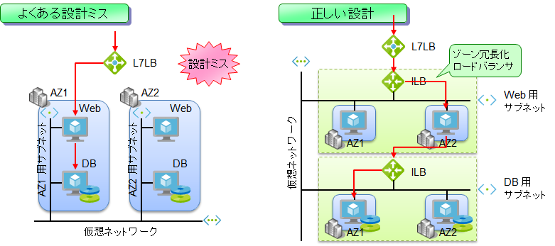
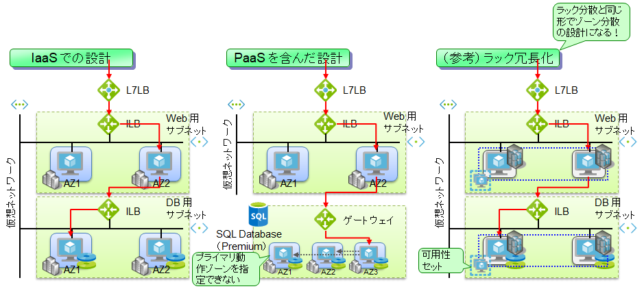

# Spoke VNET 作成

続いて、仮想ネットワークを作成します。

  

仮想ネットワークの作成に関しては、以下の点に注意してください。

- 本作業は、業務システム A の開発チームの作業者ではなく、ネットワーク管理チームの作業者が行います。
  - 本デモでは権限分掌を行っており、業務システムの開発チーム側に対してネットワーク関連の権限を開放していないためです。
- サブネットは、「ゾーン」単位ではなく「物理層（ティア、Tier）」単位に作成します。
  - Azure では、サブネットがゾーンに固定されない（ゾーンをまたがることができる）という特性があります。このため、冗長化設計の考え方として、「1 つの物理層（Web 層、DB 層など）を複数のゾーンに分散させることで、層単位に高い冗長性を確保する」という考え方で設計を行うことができます。
  -   
  - このような構成は、特に IaaS/PaaS を組み合わせた設計で有利になります。Web サーバを IaaS で、DB サーバを PaaS で構成するような場合でも、DB サーバをゾーン単位に複数立てたり、Web サーバとペアリングしたりする必要がありません。また、可用性ゾーンまでの冗長性が不要であれば、ラック冗長化（可用性セット）を使うことができますが、可用性ゾーンと可用性セットで設計モデルが同じになっていることもわかると思います。
  -   
  - 「サブネットをゾーン単位ではなく物理層単位に切る」という考え方は、他社クラウドと異なるポイントであるため、設計の際はご注意ください。詳細を知りたい方は、[こちら](https://github.com/Azure/jp-techdocs)の	仮想ネットワーク設計(nakama)をご確認ください。
- VNET ピアリングは、Hub VNET と Ops VNET の双方に対して行います。
  - オンプレにおける「本番／運用」ネットワーク分離に相当する作業です。詳細は[こちら](/02.%E7%AE%A1%E7%90%86%E3%82%B5%E3%83%96%E3%82%B9%E3%82%AF%E3%83%AA%E3%83%97%E3%82%B7%E3%83%A7%E3%83%B3%E3%81%AE%E4%BD%9C%E6%88%90/02_01_OpsVNET%E4%BD%9C%E6%88%90.md)。
- UDR を利用して、すべてのインターネット向け外向き通信が Azure Firewall を通過するようにします。
- （本デモでは行っていませんが）DNS サーバは、通常の内部 DNS サーバ（WireServer, 168.63.129.16）ではなく、VNET ピアリングされた先にある Azure Firewall を利用します。
  - 地続きの VNET に関する DNS 管理を容易化するためです。詳細は[こちら](/04.%E7%AE%A1%E7%90%86%E5%9F%BA%E7%9B%A4%E3%81%AE%E6%A7%8B%E6%88%90%E8%A8%AD%E5%AE%9A/04_03_PrivateDNSZones%E3%81%AE%E4%BD%9C%E6%88%90.md)。
  - Azure Firewall のネットワークルール機能（TCP/IP 通信を FQDN 名でフィルタ制御する機能）を使いたい場合もこの設定が必要になります。

```bash

# ピアリングは双方のネットワークの可視化と書き込み権限が必要
# このため DC 全体の Network Contributor ロールでの作業を行う
 
# NW 構成管理チーム／③ 構成変更の作業アカウントに切り替え
if ${FLAG_USE_SOD} ; then az account clear ; az login -u "user_nw_change@${PRIMARY_DOMAIN_NAME}" -p "${ADMIN_PASSWORD}" ; fi
 
# Spoke A サブスクリプションで作業
az account set -s "${SUBSCRIPTION_ID_SPOKE_A}"
 
# スポーク A VNET の作成
 
for i in ${VDC_NUMBERS}; do
  TEMP_LOCATION_NAME=${LOCATION_NAMES[$i]}
  TEMP_LOCATION_PREFIX=${LOCATION_PREFIXS[$i]}
 
  # Spoe A VNET 作成
  TEMP_RG_NAME="rg-spokea-${TEMP_LOCATION_PREFIX}"
  TEMP_VNET_NAME="vnet-spokea-${TEMP_LOCATION_PREFIX}"
  TEMP_IP_PREFIX=${IP_SPOKE_A_PREFIXS[$i]}
  TEMP_VNET_ADDRESS="${TEMP_IP_PREFIX}.0.0/16"
  TEMP_SUBNET_WEB="${TEMP_IP_PREFIX}.10.0/24"
  TEMP_SUBNET_DB="${TEMP_IP_PREFIX}.20.0/24"
  TEMP_SUBNET_DEFAULT="${TEMP_IP_PREFIX}.0.0/24"
  TEMP_NSG_NAME="${TEMP_VNET_NAME}-nsg"
  TEMP_UDR_NAME="${TEMP_VNET_NAME}-udr"
 
  az network nsg create --name ${TEMP_NSG_NAME} --resource-group ${TEMP_RG_NAME}
  az network vnet create --resource-group ${TEMP_RG_NAME} --name ${TEMP_VNET_NAME} --address-prefixes ${TEMP_VNET_ADDRESS}
  az network vnet subnet create --name "WebSubnet" --address-prefix ${TEMP_SUBNET_WEB} --resource-group ${TEMP_RG_NAME} --vnet-name ${TEMP_VNET_NAME} --nsg ${TEMP_NSG_NAME}
  az network vnet subnet create --name "DbSubnet" --address-prefix ${TEMP_SUBNET_DB} --resource-group ${TEMP_RG_NAME} --vnet-name ${TEMP_VNET_NAME} --nsg ${TEMP_NSG_NAME}
  az network vnet subnet create --name "DefaultSubnet" --address-prefix ${TEMP_SUBNET_DEFAULT} --resource-group ${TEMP_RG_NAME} --vnet-name ${TEMP_VNET_NAME} --nsg ${TEMP_NSG_NAME}
 
  # UDR 作成
  az network route-table create --resource-group ${TEMP_RG_NAME} --name ${TEMP_UDR_NAME}
 
  az account set -s "${SUBSCRIPTION_NAME_HUB}"
  TEMP_FW_IP=$(az network firewall ip-config list -g "rg-hub-${TEMP_LOCATION_PREFIX}" -f "fw-hub-${TEMP_LOCATION_PREFIX}" --query "[0].privateIpAddress" --output tsv)
  az account set -s "${SUBSCRIPTION_NAME_SPOKE_A}"
 
  az network route-table route create --resource-group ${TEMP_RG_NAME} --name default --route-table-name ${TEMP_UDR_NAME} --address-prefix 0.0.0.0/0 --next-hop-type VirtualAppliance --next-hop-ip-address ${TEMP_FW_IP}
 
  # UDR 割り当て
  az network vnet subnet update --resource-group ${TEMP_RG_NAME} --route-table ${TEMP_UDR_NAME} --ids $(az network vnet subnet show --resource-group ${TEMP_RG_NAME} --vnet-name $TEMP_VNET_NAME --name "WebSubnet" --query id -o tsv)
  az network vnet subnet update --resource-group ${TEMP_RG_NAME} --route-table ${TEMP_UDR_NAME} --ids $(az network vnet subnet show --resource-group ${TEMP_RG_NAME} --vnet-name $TEMP_VNET_NAME --name "DbSubnet" --query id -o tsv)
  az network vnet subnet update --resource-group ${TEMP_RG_NAME} --route-table ${TEMP_UDR_NAME} --ids $(az network vnet subnet show --resource-group ${TEMP_RG_NAME} --vnet-name $TEMP_VNET_NAME --name "DefaultSubnet" --query id -o tsv)
 
done
 
# VNET Peering の実施
for i in ${VDC_NUMBERS}; do
  TEMP_LOCATION_NAME=${LOCATION_NAMES[$i]}
  TEMP_LOCATION_PREFIX=${LOCATION_PREFIXS[$i]}
 
  # Spoe A VNET 作成
  TEMP_RG_NAME="rg-spokea-${TEMP_LOCATION_PREFIX}"
  TEMP_VNET_NAME="vnet-spokea-${TEMP_LOCATION_PREFIX}"
  TEMP_IP_PREFIX=${IP_SPOKE_A_PREFIXS[$i]}
  TEMP_VNET_ADDRESS="${TEMP_IP_PREFIX}.0.0/16"
  TEMP_SUBNET_WEB="${TEMP_IP_PREFIX}.10.0/24"
  TEMP_SUBNET_DB="${TEMP_IP_PREFIX}.20.0/24"
  TEMP_NSG_NAME="${TEMP_VNET_NAME}-nsg"
  TEMP_UDR_NAME="${TEMP_VNET_NAME}-udr"
 
  # Hub VNET と接続し、オンプレ環境からのアクセス Azure Firewall による outbound アクセスができるようにする
  # VNET Peering
  TEMP_HUB_VNET_ID="/subscriptions/${SUBSCRIPTION_ID_HUB}/resourceGroups/rg-hub-${TEMP_LOCATION_PREFIX}/providers/Microsoft.Network/virtualNetworks/vnet-hub-${TEMP_LOCATION_PREFIX}"
  TEMP_SPOKE_VNET_ID="/subscriptions/${SUBSCRIPTION_ID_SPOKE_A}/resourceGroups/${TEMP_RG_NAME}/providers/Microsoft.Network/virtualNetworks/${TEMP_VNET_NAME}"
 
  # Hub → Spoke
  az account set -s "${SUBSCRIPTION_NAME_HUB}"
  az network vnet peering create --name spokea --resource-group "rg-hub-${TEMP_LOCATION_PREFIX}" --vnet-name "vnet-hub-${TEMP_LOCATION_PREFIX}" --remote-vnet $TEMP_SPOKE_VNET_ID --allow-vnet-access
 
  # Spoke → Hub
  az account set -s "${SUBSCRIPTION_NAME_SPOKE_A}"
  az network vnet peering create --name hub --resource-group ${TEMP_RG_NAME} --vnet-name ${TEMP_VNET_NAME} --remote-vnet $TEMP_HUB_VNET_ID --allow-vnet-access
 
  # 運用管理用の Ops VNET と接続し、メンテナンスできるようにする
  # VNET Peering
  TEMP_OPS_VNET_ID="/subscriptions/${SUBSCRIPTION_ID_MGMT}/resourceGroups/rg-ops-${TEMP_LOCATION_PREFIX}/providers/Microsoft.Network/virtualNetworks/vnet-ops-${TEMP_LOCATION_PREFIX}"
  TEMP_SPOKE_VNET_ID="/subscriptions/${SUBSCRIPTION_ID_SPOKE_A}/resourceGroups/${TEMP_RG_NAME}/providers/Microsoft.Network/virtualNetworks/${TEMP_VNET_NAME}"
 
  # Ops → Spoke
  az account set -s "${SUBSCRIPTION_NAME_MGMT}"
  az network vnet peering create --name spokea --resource-group "rg-ops-${TEMP_LOCATION_PREFIX}" --vnet-name "vnet-ops-${TEMP_LOCATION_PREFIX}" --remote-vnet $TEMP_SPOKE_VNET_ID --allow-vnet-access
 
  # Spoke → Ops
  az account set -s "${SUBSCRIPTION_NAME_SPOKE_A}"
  az network vnet peering create --name ops --resource-group ${TEMP_RG_NAME} --vnet-name ${TEMP_VNET_NAME} --remote-vnet $TEMP_OPS_VNET_ID --allow-vnet-access
 
done

```
