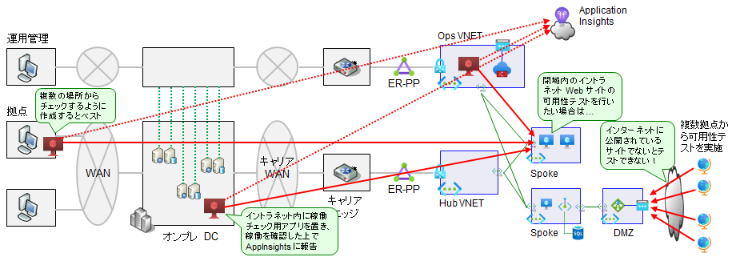

# AppInsights 可用性テストの作成

Application Insights には可用性テストと呼ばれる機能があり、これを利用すると Web アプリの稼働監視（外形監視）を行うことができます。しかし、一般的な可用性テストはインターネット上のサイトから稼働確認を行うため、当該 Web アプリがインターネットに晒されている必要があります。このため本サンプルのようなイントラネットアプリに対して標準の可用性テストの機能をそのまま利用することができませんが、自分で Web アプリの可用性をチェックし、Application Insights SDK を利用して可用性レポートをアップロードすることは可能です。

  

PowerShell や C# のコードと ApplicaitonInsights SDK を利用して可用性をレポートします。具体的なやり方は以下の通りです。
 
- vm-ops-eus へログインし、PowerShell を管理者権限で開く
- 以下の 2 行を 1 行ずつ PowerShell から実行、これにより当該フォルダに  Microsoft.ApplicationInsights パッケージがダウンロードされる

```PowerShell 

Invoke-WebRequest -Uri " https://dist.nuget.org/win-x86-commandline/latest/nuget.exe" -OutFile ".\nuget.exe"

.\nuget.exe install Microsoft.ApplicationInsights

```

- 続いて notepad ping.ps1 で以下の中身を持つファイルを作成
  - $testUrl, $APPLICATIONINSIGHTS_CONNECTION_STRING を適切な値に修正する
- その後、.\ping.ps1 で実行すると可用性が AppInsights レポートされる
  - Azure ポータルの AppInsights の管理画面から可用性を確認できるようになり、他のデータとの突合せも可能になる

```PowerShell Script

param(
    [string]$testName = "AvailabilityTest",
    [string]$location = [System.Net.Dns]::GetHostName(),
    [string]$testUrl = " http://10.1.10.4/Home/Ping",
    [string]$APPLICATIONINSIGHTS_CONNECTION_STRING = "XXXXXXXXXXXXXXXXXXX",
    [int]$intervalSecs = 10
)
 
$packageDir = Get-ChildItem -Name Microsoft.ApplicationInsights.* | Sort-Object | Select-Object -Last 1
Add-Type -Path ".\$packageDir\lib\netstandard2.0\Microsoft.ApplicationInsights.dll"
 
$telemetryConfiguration = New-Object Microsoft.ApplicationInsights.Extensibility.TelemetryConfiguration
$telemetryConfiguration.ConnectionString = $APPLICATIONINSIGHTS_CONNECTION_STRING
$telemetryConfiguration.TelemetryChannel = New-Object Microsoft.ApplicationInsights.Channel.InMemoryChannel
$telemetryClient = New-Object Microsoft.ApplicationInsights.TelemetryClient($telemetryConfiguration)
 
while ($true) {
    $availability = New-Object Microsoft.ApplicationInsights.DataContracts.AvailabilityTelemetry
    $availability.Name = $testName
    $availability.RunLocation = $location
    $availability.Success = $false
 
    $stopwatch = New-Object System.Diagnostics.Stopwatch
    $stopwatch.Start()
 
    try {
        $response = Invoke-WebRequest -Uri $testUrl
        if ($response.StatusCode -eq 200) {
            $availability.Success = $true
        }
    }
    catch {
        $availability.Message = $_.Exception.Message
    }
    finally {
        $stopwatch.Stop()
        Write-Host "Ping to $testUrl is $($availability.Success)."
        $availability.Duration = $stopwatch.Elapsed
        $availability.Timestamp = [System.DateTimeOffset]::UtcNow
        $telemetryClient.TrackAvailability($availability)
        $telemetryClient.Flush()
        Write-Host "Reported to AppInsights."
    }
    Start-Sleep -Seconds $intervalSecs
}

```
