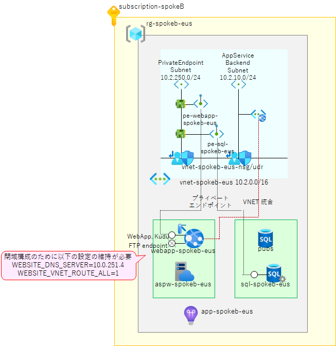

# Spoke VNET の作成

業務システム B 用のスポーク VNET を作成します。

- 今回のシステムでは、VNET、プライベートエンドポイント、VNET 統合機能を利用して、閉域化を行いながらサービスを利用します。
  - 既定では、Web App, SQL DB はどちらもパブリックエンドポイントを利用します（＝パブリック IP アドレスを使ってサービスにアクセスします）。しかし、特にエンプラ系企業の場合にはインターネットからアクセスさせたいわけではなく、自社内（イントラネット）に閉じた形で Web サーバや DB サーバを利用したいことも多いと思います。
  - このような場合には、プライベートエンドポイントと VNET 統合と呼ばれる機能を使うとともに、パブリックアクセスをブロックすることで、イントラネットからのアクセスのみに限定してサービスを利用することができます。
  -   
  - 今回のシステムの場合は、フロント／バックで VNET を分けるのも面倒なため、下図のようにして 1 つの VNET のみで済ませるように構成しています。
  -   
- まず本ステップでは、VNET 部分を作成し、Ops VNET, Hub VNET とピアリングを行います。
  - DNS サーバとしては Hub VNET の Azure Firewall を利用します。（詳細は[こちら](/04.%E7%AE%A1%E7%90%86%E5%9F%BA%E7%9B%A4%E3%81%AE%E6%A7%8B%E6%88%90%E8%A8%AD%E5%AE%9A/04_03_PrivateDNSZones%E3%81%AE%E4%BD%9C%E6%88%90.md)）

```bash

# ピアリングは双方のネットワークの可視化と書き込み権限が必要
# このため DC 全体の Network Contributor ロールでの作業を行う

# NW 構成管理チーム／③ 構成変更の作業アカウントに切り替え
if ${FLAG_USE_SOD} ; then az account clear ; az login -u "user_nw_change@${PRIMARY_DOMAIN_NAME}" -p "${ADMIN_PASSWORD}" ; fi

# Spoke B サブスクリプションで作業
az account set -s "${SUBSCRIPTION_ID_SPOKE_B}"

# スポーク B VNET の作成

for i in ${VDC_NUMBERS}; do
TEMP_LOCATION_NAME=${LOCATION_NAMES[$i]}
TEMP_LOCATION_PREFIX=${LOCATION_PREFIXS[$i]}

# Spoke B VNET 作成
TEMP_RG_NAME="rg-spokeb-${TEMP_LOCATION_PREFIX}"
TEMP_VNET_NAME="vnet-spokeb-${TEMP_LOCATION_PREFIX}"
TEMP_IP_PREFIX=${IP_SPOKE_B_PREFIXS[$i]}
TEMP_VNET_ADDRESS="${TEMP_IP_PREFIX}.0.0/16"
TEMP_SUBNET_PE="${TEMP_IP_PREFIX}.250.0/24"
TEMP_SUBNET_ASB="${TEMP_IP_PREFIX}.10.0/24"
TEMP_SUBNET_DEFAULT="${TEMP_IP_PREFIX}.0.0/24"
TEMP_NSG_NAME="${TEMP_VNET_NAME}-nsg"
TEMP_UDR_NAME="${TEMP_VNET_NAME}-udr"

az network nsg create --name ${TEMP_NSG_NAME} --resource-group ${TEMP_RG_NAME}
az network vnet create --resource-group ${TEMP_RG_NAME} --name ${TEMP_VNET_NAME} --address-prefixes ${TEMP_VNET_ADDRESS}
az network vnet subnet create --name "AppServiceBackendSubnet" --address-prefix ${TEMP_SUBNET_ASB} --resource-group ${TEMP_RG_NAME} --vnet-name ${TEMP_VNET_NAME} --nsg ${TEMP_NSG_NAME}
az network vnet subnet create --name "PrivateEndpointSubnet" --address-prefix ${TEMP_SUBNET_PE} --resource-group ${TEMP_RG_NAME} --vnet-name ${TEMP_VNET_NAME} --nsg ${TEMP_NSG_NAME}
az network vnet subnet create --name "DefaultSubnet" --address-prefix ${TEMP_SUBNET_DEFAULT} --resource-group ${TEMP_RG_NAME} --vnet-name ${TEMP_VNET_NAME} --nsg ${TEMP_NSG_NAME}

# UDR 作成
az network route-table create --resource-group ${TEMP_RG_NAME} --name ${TEMP_UDR_NAME}

az account set -s "${SUBSCRIPTION_NAME_HUB}"
TEMP_FW_IP=$(az network firewall ip-config list -g "rg-hub-${TEMP_LOCATION_PREFIX}" -f "fw-hub-${TEMP_LOCATION_PREFIX}" --query "[0].privateIpAddress" --output tsv)
az account set -s "${SUBSCRIPTION_NAME_SPOKE_B}"

az network route-table route create --resource-group ${TEMP_RG_NAME} --name default --route-table-name ${TEMP_UDR_NAME} --address-prefix 0.0.0.0/0 --next-hop-type VirtualAppliance --next-hop-ip-address ${TEMP_FW_IP}

# UDR 割り当て
az network vnet subnet update --route-table ${TEMP_UDR_NAME} --ids $(az network vnet subnet show --resource-group ${TEMP_RG_NAME} --vnet-name $TEMP_VNET_NAME --name "AppServiceBackendSubnet" --query id -o tsv)
az network vnet subnet update --route-table ${TEMP_UDR_NAME} --ids $(az network vnet subnet show --resource-group ${TEMP_RG_NAME} --vnet-name $TEMP_VNET_NAME --name "DefaultSubnet" --query id -o tsv)
az network vnet subnet update --route-table ${TEMP_UDR_NAME} --ids $(az network vnet subnet show --resource-group ${TEMP_RG_NAME} --vnet-name $TEMP_VNET_NAME --name "PrivateEndpointSubnet" --query id -o tsv)

done # TEMP_LOCATION

# VNET Peering の実施
for i in ${VDC_NUMBERS}; do
TEMP_LOCATION_NAME=${LOCATION_NAMES[$i]}
TEMP_LOCATION_PREFIX=${LOCATION_PREFIXS[$i]}

TEMP_RG_NAME="rg-spokeb-${TEMP_LOCATION_PREFIX}"
TEMP_VNET_NAME="vnet-spokeb-${TEMP_LOCATION_PREFIX}"
TEMP_IP_PREFIX=${IP_SPOKE_B_PREFIXS[$i]}
TEMP_VNET_ADDRESS="${TEMP_IP_PREFIX}.0.0/16"

# Hub VNET と接続し、オンプレ環境からのアクセス Azure Firewall による outbound アクセスができるようにする
# VNET Peering
TEMP_HUB_VNET_ID="/subscriptions/${SUBSCRIPTION_ID_HUB}/resourceGroups/rg-hub-${TEMP_LOCATION_PREFIX}/providers/Microsoft.Network/virtualNetworks/vnet-hub-${TEMP_LOCATION_PREFIX}"
TEMP_SPOKE_VNET_ID="/subscriptions/${SUBSCRIPTION_ID_SPOKE_B}/resourceGroups/${TEMP_RG_NAME}/providers/Microsoft.Network/virtualNetworks/${TEMP_VNET_NAME}"

# Hub → Spoke
az account set -s "${SUBSCRIPTION_NAME_HUB}"
az network vnet peering create --name spokeb --resource-group "rg-hub-${TEMP_LOCATION_PREFIX}" --vnet-name "vnet-hub-${TEMP_LOCATION_PREFIX}" --remote-vnet $TEMP_SPOKE_VNET_ID --allow-vnet-access

# Spoke → Hub
az account set -s "${SUBSCRIPTION_NAME_SPOKE_B}"
az network vnet peering create --name hub --resource-group ${TEMP_RG_NAME} --vnet-name ${TEMP_VNET_NAME} --remote-vnet $TEMP_HUB_VNET_ID --allow-vnet-access

# 運用管理用の Ops VNET と接続し、メンテナンスできるようにする
# VNET Peering
TEMP_OPS_VNET_ID="/subscriptions/${SUBSCRIPTION_ID_MGMT}/resourceGroups/rg-ops-${TEMP_LOCATION_PREFIX}/providers/Microsoft.Network/virtualNetworks/vnet-ops-${TEMP_LOCATION_PREFIX}"
TEMP_SPOKE_VNET_ID="/subscriptions/${SUBSCRIPTION_ID_SPOKE_B}/resourceGroups/${TEMP_RG_NAME}/providers/Microsoft.Network/virtualNetworks/${TEMP_VNET_NAME}"

# Ops → Spoke
az account set -s "${SUBSCRIPTION_NAME_MGMT}"
az network vnet peering create --name spokeb --resource-group "rg-ops-${TEMP_LOCATION_PREFIX}" --vnet-name "vnet-ops-${TEMP_LOCATION_PREFIX}" --remote-vnet $TEMP_SPOKE_VNET_ID --allow-vnet-access

# Spoke → Ops
az account set -s "${SUBSCRIPTION_NAME_SPOKE_B}"
az network vnet peering create --name ops --resource-group ${TEMP_RG_NAME} --vnet-name ${TEMP_VNET_NAME} --remote-vnet $TEMP_OPS_VNET_ID --allow-vnet-access

done # TEMP_LOCATION

```
