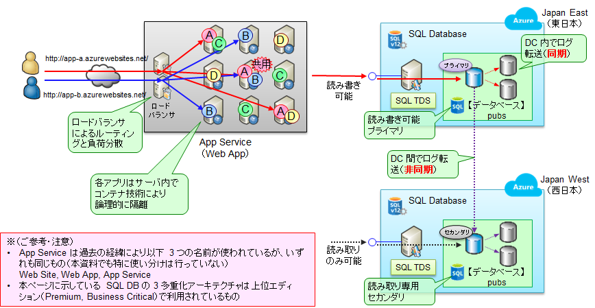

# PaaS 型 Web-DB システムについて

先のセクションでは IaaS VM を利用して Web-DB システムを構成しましたが、ベースになっている仮想マシンの準備などがかなり面倒でした。このため、特に新規開発などの場合には、PaaS 型サービスをご利用いただいてシステムを構築することをオススメします。特に、Azure には Web App (App Service) と SQL Database という非常に便利な PaaS サービスがあります。

- App Service （Web App） = クラスタリングされた、自動メンテナンスつき Web サーバ
- SQL Database = クラスタリングされた、自動メンテナンスつき SQL Server

どちらのサービスも Azure の黎明期から提供されており、すでに 10 年以上の稼働実績があるにもかかわらず、現在でもサービスの拡充が行われ続けている Azure の超重要サービスです。PaaS サービスであるため、基盤（OS・ミドルウェア）部分はマイクロソフトにお任せすることができ、ユーザ側はアプリやデータの部分に注力することができます。……といっても裏側で動作をしているのは IaaS VM だったりしますので、どんなものかを理解するには、下図のような昔ながらのサーバ構成図のようなものの方が理解しやすいかもしれません。

- Web App : ロードバランサ ＋ クラスタ化された Web サーバ上に、複数のアプリをコンテナ技術により隔離しながら搭載することができる
- SQL DB （上位 SKU の場合） : 拠点内で 3 多重化されたデータベース、別 DC のセカンダリ DB へもほぼリアルタイムにデータを複製可能（平常時の遅延は 1 秒以下）

  

本セクションでは、この Web App (App Service) と SQL Databsae を利用して、前セクションと同様の Web-DB システムを構築します。
