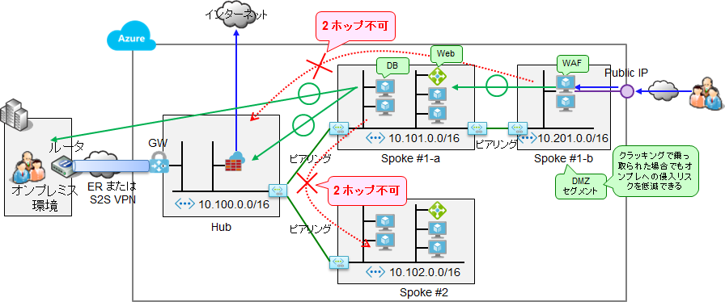
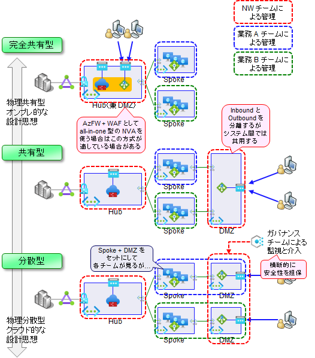

# DMZ WAF の作成

引き続き、作成した PaaS 型 Web-DB システムの外側に WAF (Web Application Firewall) を追加し、パブリックインターネットからアクセスできるようにします。

- インターネットから当該システムにアクセスできるようにするための WAF は、業務システムを配置しているスポーク VNET の外側に、別の VNET （DMZ セグメントとなる VNET）を利用して作成します。
  - 下図に示すように、VNET ピアリングには「2 段ホップができない」という特性があります。このため、VNET を分けてそこに WAF を立てると、万が一 WAF がクラックされた場合でも、即時にハブ VNET やイントラネットまで侵入されるというリスクを低減することができます。
  -   
- 今回のシステムではさらにセキュリティを向上させるため、上記に加えて以下 2 つの対策を行っています。
  - DMZ セグメントに、PaaS サービス（マネージドサービス）である Application Gateway を利用して WAF を作成します。
    - IaaS VM を利用して自力でセキュリティ管理をするよりも遥かに容易に DMZ セグメントを構成できます。
    - また、Ops VNET からこの DMZ セグメントに VNET ピアリングをする必要もなくなりますので、運用 VNET へ侵入されることもなくなります。
  - DMZ セグメントからアプリへのアクセスに、プライベートエンドポイントを利用します。
    - これにより、DMZ セグメントからスポーク VNET に侵入されるリスクを軽減できます。
  -   

なお、備考として、

- 本来であればこの Application Gateway では以下の 2 つの機能を有効化すべきですが、いずれも非常に高額なリソースであるため、今回は割愛します。
  - WAF 機能 (WAF SKU)
  - DDoS Protection Standard
- WAF はハブ VNET 上に配置せず、スポーク VNET の外側に作成するようにします。
  - オンプレミスではコストと管理の観点から、インターネットとの入出力（inbound/outbound 通信管理）を完全に一か所に集め、高額なハードウェアアプライアンス製品などで固める設計が一般的でした。（回線管理やコスト効率性の観点から一か所に集めざるを得ませんでした）。しかし一か所に集めすぎているが故に柔軟性に欠ける場合も多く（穴開けや設定変更に伴うリグレッションリスクが高いため）、ファイアウォールの穴開け（設定変更）に数カ月を要する、といった事態に陥っているケースも散見されます。
  - クラウド環境の場合、共用サービス・従量課金型であるため、入口や出口を分散配置するという選択肢も取れます。さらに、Azure Firewall や Application Gateway をシステムごとに配置する、といった選択肢も取ることができます。分散配置した場合でも、設定の一貫性を保つ仕組みの利用や、横断的な監視が可能です。（例：ファイアウォールポリシーを使って、ルールを階層型で管理するなど）
  -   
- outbound ファイアウォールや inbound DMZ WAF をどこまで共有するか、また各サービスを誰が管理するのかは、各企業の実態や利用するサービスに併せて検討してください。
  - Hub/Spoke 構成の仮想ネットワークの場合、Azure Firewall は比較的共有しやすい一方で、Application Gateway はもともとサービスの機能自体がシンプルなこともあり、複数の業務システムでは共有しにくい側面もあります。このため、Azure 標準サービスで構成する場合には、「Azure Firewall は複数の Spoke VNET から共有」「Application Gateway は必要なシステムで個別に持つ」「Application Gateway の設定は横断的に管理」とするのがよいでしょう。
  - 一方、outbound ファイアウォールや inbound DMZ WAF として Azure サービスではなく NVA 製品を利用する場合、構築・運用・保守コストが比較的高価になります。このため、システムごとに構築するよりも、複数のシステムで共有する構成をご検討いただいた方がよい可能性もあります。
  -   

以降では、以下のパターンに従った具体的な作業手順を以降に示します。

- Azure 標準サービスで構成する
- Azure Firewall は複数の Spoke VNET から共有する
- Application Gateway は必要なシステムで個別に持つ
