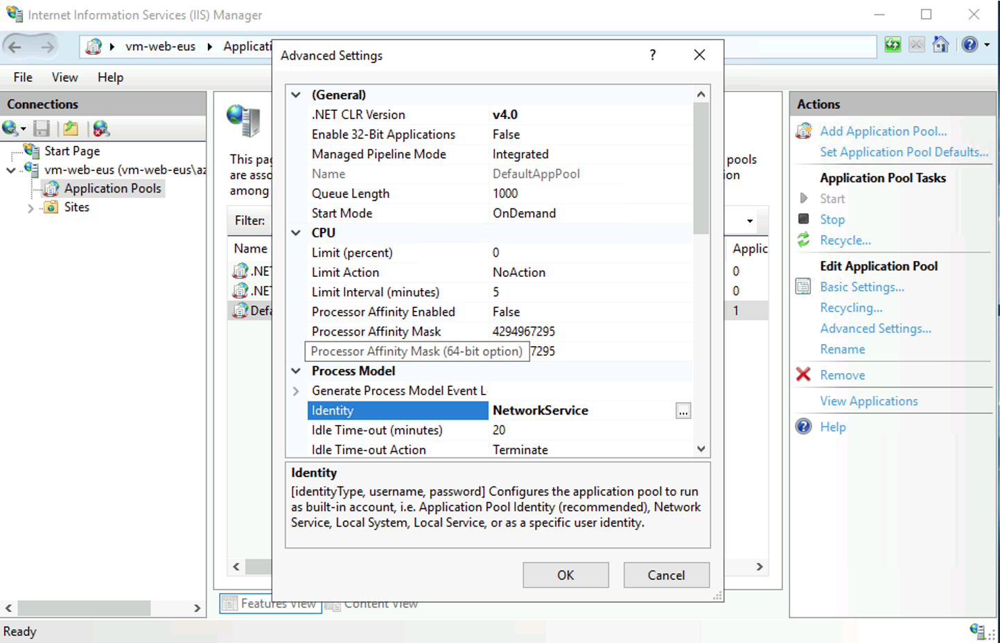
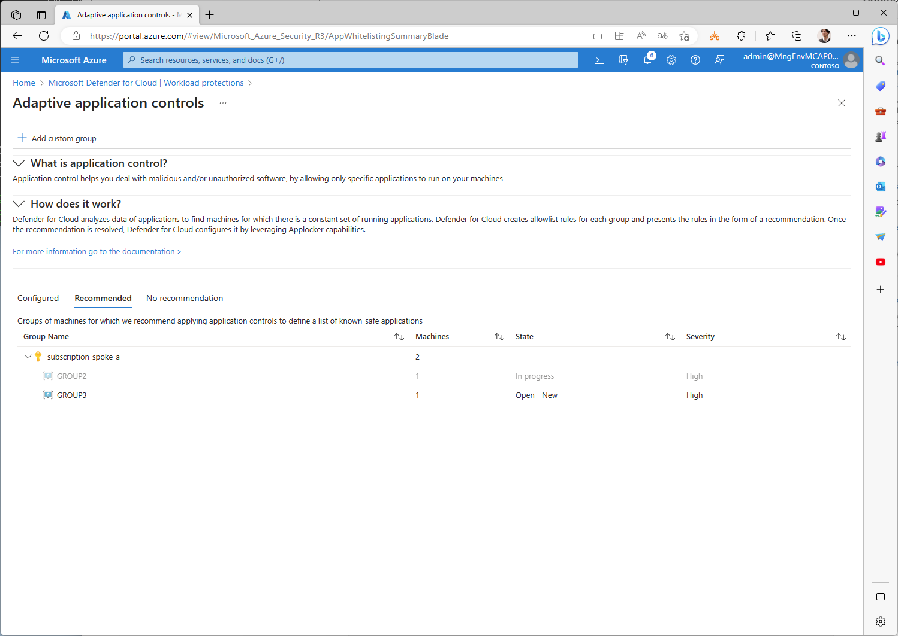

# （参考）是正や適用除外のサンプルスクリプト

**今回は利用しませんが**、よく利用されると思われる是正や適用除外のサンプルスクリプトをいくつか示します。必要な場合にカスタマイズしてご利用ください。

## 適用除外の例

### MFA の適用除外

```bash
 
# ■ MFA の適用除外（※ テスト目的の場合のみ）
# 特定アカウントのみ免除する場合は以下
for TEMP_SUBSCRIPTION_ID in $SUBSCRIPTION_IDS; do
 
TEMP_RESOURCE_ID="/subscriptions/${TEMP_SUBSCRIPTION_ID}"
 
for TEMP_POLICY_REF_ID in "identityEnableMFAForOwnerPermissionsMonitoring" "identityEnableMFAForOwnerPermissionsMonitoringNew" "identityEnableMFAForWritePermissionsMonitoring" "identityEnableMFAForWritePermissionsMonitoringEffect" "identityEnableMFAForReadPermissionsMonitoring" "identityEnableMFAForReadPermissionsMonitoringNew" ; do
 
TEMP_EXEMPTION_ID=$(uuidgen --sha1 --namespace @oid --name "${TEMP_RESOURCE_ID}_${TEMP_POLICY_REF_ID}_${TEMP_ASSIGNMENT_ID}")
az policy exemption create \
	--name "${TEMP_EXEMPTION_ID}" \
	--exemption-category Waiver \
	--policy-definition-reference-ids "${TEMP_POLICY_REF_ID}" \
	--scope ${TEMP_RESOURCE_ID} \
	--policy-assignment "${TEMP_ASSIGNMENT_ID}"
done
done

```

### Cloud Shell 用のストレージアカウントに対するセキュリティ適用免除

```bash
 
# ■ Cloud Shell 用のストレージに対するネットワークセキュリティ確保の適用免除
# Storage accounts should restrict network access using virtual network rules
# /providers/Microsoft.Authorization/policyDefinitions/2a1a9cdf-e04d-429a-8416-3bfb72a1b26f
# storageAccountsShouldRestrictNetworkAccessUsingVirtualNetworkRulesMonitoringEffect
# Storage accounts should use private link
# /providers/Microsoft.Authorization/policyDefinitions/6edd7eda-6dd8-40f7-810d-67160c639cd9
# storageAccountShouldUseAPrivateLinkConnectionMonitoringEffect
# [Preview]: Storage account public access should be disallowed
# /providers/Microsoft.Authorization/policyDefinitions/4fa4b6c0-31ca-4c0d-b10d-24b96f62a751
# StorageDisallowPublicAccess
# Storage accounts should restrict network access
# /providers/Microsoft.Authorization/policyDefinitions/34c877ad-507e-4c82-993e-3452a6e0ad3c
# disableUnrestrictedNetworkToStorageAccountMonitoring
 
TEMP_EXEMPTION_NAME="Test-Exemption-CloudShell"
cat > temp.json << EOF
{
  "properties": {
    "policyAssignmentId": "${TEMP_ASSIGNMENT_ID}",
    "policyDefinitionReferenceIds": [
      "storageAccountsShouldRestrictNetworkAccessUsingVirtualNetworkRulesMonitoringEffect",
      "storageAccountShouldUseAPrivateLinkConnectionMonitoringEffect",   
      "StorageDisallowPublicAccess",
      "disableUnrestrictedNetworkToStorageAccountMonitoring"
    ],
    "exemptionCategory": "Waiver",
    "displayName": "テスト目的での免除 - Cloud Shell の検査を免除",
    "description": "テスト目的での免除 - Cloud Shell の検査を免除",
    "metadata": {
      "reason": "テストのため"
    }
  }
}
EOF
 
# 以下は要修正
TEMP_RESOURCE_ID="/subscriptions/903c6183-3adc-4577-9114-b3fef417ff28/resourcegroups/cloud-shell-storage-southeastasia/providers/microsoft.storage/storageaccounts/cs11003200268ab0a3c"
az rest --method PUT --uri "${TEMP_RESOURCE_ID}/providers/Microsoft.Authorization/policyExemptions/${TEMP_EXEMPTION_NAME}?api-version=2022-07-01-preview" --body @temp.json

```

### エージェントの自動プロビジョニング機能の適用除外

```bash

# ■ エージェントの自動プロビジョニング機能の利用の適用を除外 (Mitigated)
# エージェントの自動配置は行わないため
# Auto provisioning of the Log Analytics agent should be enabled on your subscription
# /providers/Microsoft.Authorization/policyDefinitions/475aae12-b88a-4572-8b36-9b712b2b3a17
# autoProvisioningOfTheLogAnalyticsAgentShouldBeEnabledOnYourSubscriptionMonitoringEffect
 
TEMP_EXEMPTION_NAME="Exemption-MDfC-AgentAutoProvisioning"
cat > temp.json << EOF
{
  "properties": {
    "policyAssignmentId": "${TEMP_ASSIGNMENT_ID}",
    "policyDefinitionReferenceIds": [
      "autoProvisioningOfTheLogAnalyticsAgentShouldBeEnabledOnYourSubscriptionMonitoringEffect"
    ],
    "exemptionCategory": "Mitigated",
    "displayName": "エージェントの自動プロビジョニング機能の利用を除外 (Mitigated)",
    "description": "エージェントの自動配置は行わないため"
  }
}
EOF
 
for TEMP_RESOURCE_ID in $(az account subscription list --query [].id -o tsv); do
az rest --method PUT --uri "${TEMP_RESOURCE_ID}/providers/Microsoft.Authorization/policyExemptions/${TEMP_EXEMPTION_NAME}?api-version=2022-07-01-preview" --body @temp.json
done

```

### カスタムロールの Audit の除外

```bash

# ■ 作成しているカスタムロールを Audit 対象から除外 (Mitigated)
# 既定ではカスタムロールの作成そのものが Audit 対象になっているため。Mitigated を作成して承認済みであることを登録しておく
# ※ 下記スクリプトでは簡単のためにすべてのカスタムロールを一括で除外対象としたが、実際にはひとつずつ確認して除外すること
# ※ サブスクリプション単位の除外が必要 ⇒ Tenant Root Group レベルでカスタムロールを定義している場合、サブスクリプションが増えるつど設定が必要なため厄介。カスタムロールをフル活用する前提であれば、useRbacRulesMonitoringEffect を disabled にすることで対応。
# Audit usage of custom RBAC roles
# /providers/Microsoft.Authorization/policyDefinitions/a451c1ef-c6ca-483d-87ed-f49761e3ffb5
# useRbacRulesMonitoring
 
TEMP_EXEMPTION_NAME="Exemption-CustomRole"
cat > temp.json << EOF
{
  "properties": {
    "policyAssignmentId": "${TEMP_ASSIGNMENT_ID}",
    "policyDefinitionReferenceIds": [
      "useRbacRulesMonitoring"
    ],
    "exemptionCategory": "Mitigated",
    "displayName": "承認されたカスタム RBAC ロール",
    "description": "承認されたカスタム RBAC ロール"
  }
}
EOF

for TEMP_SUBSCRIPTION_ID in ${SUBSCRIPTION_IDS}; do
az account set -s ${TEMP_SUBSCRIPTION_ID}
 
for TEMP_RESOURCE_ID in $(az role definition list --custom-role-only true --query [].id -o tsv); do
 
az rest --method PUT --uri "${TEMP_RESOURCE_ID}/providers/Microsoft.Authorization/policyExemptions/${TEMP_EXEMPTION_NAME}?api-version=2022-07-01-preview" --body @temp.json
 
done # TEMP_RESOURCE_ID
done # TEMP_SUBSCRIPTION_ID
 

```

### Preview ポリシーの適用除外

```bash

# ■ ポリシーがまだ preview であるため audit 対象から除外
# 例）[Preview]: Microsoft Defender for APIs should be enabled
# /providers/Microsoft.Authorization/policyDefinitions/7926a6d1-b268-4586-8197-e8ae90c877d7
enableDefenderForApis
 
TEMP_EXEMPTION_NAME="Exemption-PreviewPolicy-enableDefenderForApis"
TEMP_EXPIRATION_DATETIME=$(date -u -d "+6 month" "+%Y-%m-%dT%H:%M:%SZ")
 
cat > temp.json << EOF
{
  "properties": {
    "policyAssignmentId": "${TEMP_ASSIGNMENT_ID}",
    "policyDefinitionReferenceIds": [
      "enableDefenderForApis"
    ],
    "exemptionCategory": "Waiver",
    "displayName": "現時点では Preview ポリシーのため適用を免除",
    "description": "現時点では Preview ポリシーのため適用を免除",
    "expiresOn": "${TEMP_EXPIRATION_DATETIME}"
  }
}
EOF
 
for TEMP_SUBSCRIPTION_ID in $(az account subscription list --query [].subscriptionId -o tsv); do
az account set -s ${TEMP_SUBSCRIPTION_ID}
 
TEMP_RESOURCE_ID="/subscriptions/${TEMP_SUBSCRIPTION_ID}"
az rest --method PUT --uri "${TEMP_RESOURCE_ID}/providers/Microsoft.Authorization/policyExemptions/${TEMP_EXEMPTION_NAME}?api-version=2022-07-01-preview" --body @temp.json
 
done # TEMP_SUBSCRIPTION_ID

```

## 是正処理の例

## NSG、UDR 設定漏れの修正

```bash
TEMP_VNET_NAME="vnet-spokebdmz-eus"
TEMP_NSG_NAME="${TEMP_VNET_NAME}-nsg"
TEMP_UDR_NAME="${TEMP_VNET_NAME}-udr"
TEMP_RG_NAME="rg-spokebdmz-eus"
TEMP_SUBNET_NAME="PrivateEndpointSubnet"
 
az network nsg create --name ${TEMP_NSG_NAME} --resource-group ${TEMP_RG_NAME}
az network route-table create --resource-group ${TEMP_RG_NAME} --name ${TEMP_UDR_NAME}
az network vnet subnet update --resource-group ${TEMP_RG_NAME} --route-table ${TEMP_UDR_NAME} --ids $(az network vnet subnet show --resource-group ${TEMP_RG_NAME} --vnet-name $TEMP_VNET_NAME --name ${TEMP_SUBNET_NAME} --query id -o tsv) --disable-private-endpoint-network-policies false
```

## KeyVault のネットワークファイアウォールの有効化

```bash
TEMP_SUBSCRIPTION_ID="${SUBSCRIPTION_ID_SPOKE_A}"
TEMP_RG_NAME="rg-test"
TEMP_KV_NAME="kv-test-spokea"
 
az account set -s $TEMP_SUBSCRIPTION_ID
az keyvault update --name $TEMP_KV_NAME --resource-group $TEMP_RG_NAME --default-action Deny
```

## Storage Account のネットワークファイアウォールの有効化

```bash
# Blob へのパブリックアクセスを禁止
# [Preview]: Storage account public access should be disallowed
 
TEMP_SUBSCRIPTION_ID="${SUBSCRIPTION_ID_SPOKE_A}"
TEMP_RG_NAME="rg-test"
TEMP_STORAGE_NAME="testspokea"
 
az account set -s $TEMP_SUBSCRIPTION_ID
az storage account update --name ${TEMP_STORAGE_NAME} --resource-group $TEMP_RG_NAME --default-action Deny --allow-blob-public-access false
```

## App Service の HTTP 通信を無効化し HTTPS のみにする

```bash
# App Service apps should only be accessible over HTTPS
 
TEMP_WEBAPP_NAME="webapp-spokeb-${UNIQUE_SUFFIX}-eus"
TEMP_RG_NAME="rg-spokeb-eus"
az account set -s "${SUBSCRIPTION_ID_SPOKE_B}"
 
az webapp update --https-only true --name "${TEMP_WEBAPP_NAME}" --resource-group "${TEMP_RG_NAME}"
```

## IIS のワーカープロセスの動作アカウントを変更する

ワーカープロセス単位に動作アカウントが異なることに注意。

```bash
Import-Module WebAdministration
Set-ItemProperty "IIS:\AppPools\DefaultAppPool" -name "processModel.identityType" -value "NetworkService"
```

PowerShell が入っていない場合は GUI ツールから直接変更してもよい。




## Adaptive Application Control

- 環境を1週間ほど放置しておくと、AAC (Adaptive Appliation Control) に関する警告が上がってくる
- アプリケーションの挙動を監視し、過去になかったアプリが起動してきていないかを確認するもの
- 推奨事項などに警告が上がったら適宜確認し、監査を行うようにする

  

  
```bash
# ■ ポリシーがまだ preview であるため audit 対象から除外
# 例）[Preview]: Microsoft Defender for APIs should be enabled
# /providers/Microsoft.Authorization/policyDefinitions/7926a6d1-b268-4586-8197-e8ae90c877d7

```

### MDE (TVM, EDR) の有効化 (Windows OS)

```bash

# ① MDE インストール
az vm extension set --vm-name "${TEMP_VM_NAME}" --resource-group ${TEMP_RG_NAME} --name "MDE.Windows"  --publisher "Microsoft.Azure.AzureDefenderForServers" --enable-auto-upgrade false --no-auto-upgrade-minor-version true --settings "{\"azureResourceId\":\"${TEMP_RESOURCE_ID}\", \"defenderForServersWorkspaceId\":\"${TEMP_SUBSCRIPTION_ID}\", \"vNextEnabled\":\"true\", \"forceReOnboarding\":true, \"provisionedBy\":\"Manual\" }" --protected-settings "{ \"defenderForEndpointOnboardingScript\":\"${TEMP_BASE64ENCODING_ONBOARDING_PACKAGE_WINDOWS}\"}"

# ② IaaSAntimalware インストール
cat <<EOF > tmp.json
{
    "\$schema": "https://schema.management.azure.com/schemas/2015-01-01/deploymentTemplate.json#",
    "contentVersion": "1.0.0.0",
    "resources": [
        {
            "name": "${TEMP_VM_NAME}/IaaSAntimalware",
            "type": "Microsoft.Compute/virtualMachines/extensions",
            "location": "${TEMP_LOCATION_NAME}",
            "apiVersion": "2015-06-15",
            "properties": {
                "publisher": "Microsoft.Azure.Security",
                "type": "IaaSAntimalware",
                "typeHandlerVersion": "1.3",
                "autoUpgradeMinorVersion": true,
                "settings": {
                    "AntimalwareEnabled": true,
                    "RealtimeProtectionEnabled": true,
                    "ScheduledScanSettings": {
                        "isEnabled": true,
                        "day": 7,
                        "time": 120,
                        "scanType": "Quick"
                    },
                    "Exclusions": {
                        "Extensions": "",
                        "Paths": "",
                        "Processes": ""
                    }
                }
            }
        }
    ]
}
EOF
if [ -z "$(az vm extension list --vm-name "${TEMP_VM_NAME}" --resource-group ${TEMP_RG_NAME} --query "[?name=='IaaSAntimalware']" -o tsv)" ]; then
  echo "Installing IaaSAntimalware to ${TEMP_VM_NAME}..."
az deployment group create --name "${TEMP_VM_NAME}_IaaSAntimalware" --resource-group "${TEMP_RG_NAME}" --template-file tmp.json
fi

```

### Update Management の有効化

```bash

az rest --method patch --url "https://management.azure.com/subscriptions/${TEMP_SUBSCRIPTION_ID}/resourceGroups/${TEMP_RG_NAME}/providers/Microsoft.Compute/virtualMachines/${TEMP_VM_NAME}?api-version=2021-03-01" --body "{ \"location\": \"${TEMP_LOCATION_NAME}\", \"properties\": { \"osProfile\": { \"windowsConfiguration\": { \"patchSettings\": { \"assessmentMode\": \"AutomaticByPlatform\", \"patchMode\": \"AutomaticByPlatform\" } } } } }"

# Windows Update を適用
az rest --method post --url "https://management.azure.com/subscriptions/${TEMP_SUBSCRIPTION_ID}/resourceGroups/${TEMP_RG_NAME}/providers/Microsoft.Compute/virtualMachines/${TEMP_VM_NAME}/installPatches?api-version=2022-03-01" --body "{ \"maximumDuration\": \"PT4H\", \"rebootSetting\": \"IfRequired\", \"windowsParameters\": { \"classificationsToInclude\": [ \"Critical\", \"Security\", \"UpdateRollUp\", \"FeaturePack\", \"ServicePack\", \"Definition\", \"Tools\", \"Updates\" ] }, \"linuxParameters\": { \"classificationsToInclude\": [ \"Critical\", \"Security\", \"Other\" ] } }"

```

### ADE の適用

```bash

az vm encryption enable --resource-group ${TEMP_RG_NAME} --name $TEMP_VM_NAME --disk-encryption-keyvault $TEMP_ADE_KV_NAME

```
