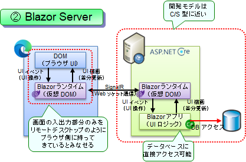

# コンテナアプリのビルド

- サンプルアプリとして ASP.NET Blazor Server アプリを利用します。
  - ASP.NET Blazor は、WASM (WebAssembly) と呼ばれるブラウザ標準技術を使って、(JavaScript ではなく) C# によって Web アプリケーションを開発できるようにした技術です。Blazor には ① Blazor WASM と ② Blazor Server の 2 種類があり、今回は Web-DB 型アプリを開発しやすい Blazor Server のサンプルを利用します。
  - Blazor Server の動作モデルを下図に示します。razor と呼ばれる Web ページを作成すると、記述した UI 部分はブラウザ上で、C# で書いたロジック部分はサーバ側で分離動作します。結果として、「DB にアクセスするサーバアプリの画面だけを Web ブラウザ上にリモートデスクトップのように描画する」ことができ、『C/S 型的な 2-Tier 型開発スタイル』を取りながら『Web ブラウザアプリ』として開発できます。開発スタイルとしては、2000 年代に一大ブームとなった ASP.NET Web Forms に近く、DB アクセスを行う Web 型の業務アプリケーション開発に最適な手法です。

### 動作アーキテクチャ

  

### 実装イメージ

※ ポイントは、同一のファイルに記述しているにもかかわらず、「記述した HTML 部分はブラウザ内で動作」「記述した C# 部分はサーバ側で動作」という点です。C# 部分はサーバで動作していますので、データベースアクセス処理をそのまま直書きすることができます。

  


- サンプルプログラムは、以下の GitHub にて公開しているものを利用します。
  - https://github.com/nakamacchi/AzRefArc.AspNetBlazorServer

- WSL 上にインストールした Docker を用いてビルドを行います。
  - 上記のサンプルプログラムに含まれている Dockerfile を利用してビルドを行います。
  - Dockerfile はマルチステージビルド方式を用いており、1 つ目のコンテナでアプリをビルドし、成果物のみを 2 つ目のコンテナにコピーすることで、配置に適した小さなコンテナを作成しています。

## WSL Ubuntu のセットアップ

- WSL をインストール・セットアップ
  - 管理者権限のコマンドラインから wsl --install を実行
  - 再起動を求められるのでリブート
- Ubuntu のセットアップ
  - 再起動後、コマンドラインから ubuntu を実行
  - 初回時はユーザ名、パスワードを聞かれるので、以下などを指定
    - ユーザ名 : azrefadmin
    - パスワード : p&ssw0rdp&ssw0rd
- インストール後、Windows OS 側から WSL Ubuntu のフォルダにアクセスできることを確認します
  - \\wsl$\Ubuntu\home\azrefadmin にアクセスしてみてください。
  - Ubuntu の管理者のホームディレクトリを Explorer から開ければ OK です。

```cmd

C:\Users\azrefadmin>wsl --install
Downloading: Ubuntu
Installing: Ubuntu
Ubuntu has been installed.

※ リブート後、自動的にコマンドプロンプトが開く

Launching Ubuntu...
Installing, this may take a few minutes...
Please create a default UNIX user account. The username does not need to match your Windows username.
For more information visit: https://aka.ms/wslusers
Enter new UNIX username: azrefadmin
New password:
Retype new password:
passwd: password updated successfully
Installation successful!
To run a command as administrator (user "root"), use "sudo <command>".
See "man sudo_root" for details.

Welcome to Ubuntu 22.04.1 LTS (GNU/Linux 5.15.90.1-microsoft-standard-WSL2 x86_64)

 * Documentation:  https://help.ubuntu.com
 * Management:     https://landscape.canonical.com
 * Support:        https://ubuntu.com/advantage

This message is shown once a day. To disable it please create the
/home/azrefadmin/.hushlogin file.
azrefadmin@vm-mnt-eus:~$

```

## Docker (on WSL) のセットアップ

- Ubuntu を起動したあと、下記スクリプトを **1 行ずつ実行して** Docker を WSL 上にセットアップします。
- 初回 sudo 時は管理者パスワードを聞かれるので入力してください。

```bash

curl -fsSL https://download.docker.com/linux/ubuntu/gpg | sudo apt-key add -
sudo add-apt-repository "deb [arch=amd64] https://download.docker.com/linux/ubuntu focal stable"
sudo apt update && sudo apt install -y docker-ce
sudo service docker start
sudo mkdir -p /sys/fs/cgroup/systemd
sudo mount -t cgroup -o none,name=systemd cgroup /sys/fs/cgroup/systemd
sudo curl -L https://github.com/docker/compose/releases/download/1.26.0/docker-compose-`uname -s`-`uname -m` -o /usr/local/bin/docker-compose
sudo chmod +x /usr/local/bin/docker-compose
sudo gpasswd -a $USER docker
sudo chgrp docker /var/run/docker.sock
sudo service docker restart

```

## サンプルアプリのダウンロード

- Edge ブラウザを起動し、以下の URL からサンプルアプリ（ASP.NET Blazor Server アプリ）のソースコードをダウンロードします。
  - https://github.com/nakamacchi/AzRefArc.AspNetBlazorServer/archive/refs/heads/master.zip
  - zip ファイル内の AzRefArc.AspNetBlazorServer-master\AzRefArc.AspNetBlazorServer.BlazorServer フォルダをデスクトップなどに取り出しておきます。（zip ファイル内から WSL へ直接ファイルコピーできないため）
- ソースコードを Windows エクスプローラから WSL 側にコピーします。
  - まず、\\wsl$\Ubuntu\home\azrefadmin フォルダを開いておきます。（ \\wsl$ というパスを使うことで同一マシン上の WSL 内のファイルシステムに、Windows OS 側からアクセスできます。）
  - デスクトップに取り出しておいたフォルダとファイルを WSL にコピーします。
    - 最終的に、zip ファイル内の AzRefArc.AspNetBlazorServer-master\AzRefArc.AspNetBlazorServer.BlazorServer フォルダとその中身が...
    - \\wsl$\Ubuntu\home\azrefadmin\AzRefArc.AspNetBlazorServer.BlazorServer フォルダにコピーされるようにコピーします。

## サンプルアプリのコンパイルとビルド

本番のコンパイルを行う前に、簡単にコンパイルとビルドの確認をしておきます。

- WSL Ubuntu に戻り、ソースコードフォルダに移動します。
  - cd ~/AzRefArc.AspNetBlazorServer.BlazorServer
- Dockerfile があるので、これを使ってビルドします。
  - sudo docker build -t app . としてコンテナを "app" という名前でビルドします。
- ビルド後、docker run コマンドでコンテナを起動・実行します。
  - sudo docker run -p:8080:80 app とすれば先ほどのコンテナを実行できますが、この方法だけだとデータベースの接続文字列がオーバライドできません。
  - このため、下記に示すコマンドラインを手元で実行し、コンテナの起動引数で接続文字列をオーバライドするコマンドラインを入手します。
    - 例えば以下のようなコマンドラインが得られます。（※ サーバ名が環境ごとに変わるため、皆さまの環境では下記のコマンドラインはそのままでは使えません）
    - sudo docker run --env "CONNECTIONSTRINGS__PUBSENTITIES=Server=tcp:sql-spokef-07541-eus.database.windows.net,1433;Initial Catalog=pubs;Persist Security Info=False;User ID=azrefadmin;Password=p&ssw0rdp&ssw0rd;MultipleActiveResultSets=False;Encrypt=True;TrustServerCertificate=False;Connection Timeout=30;" -p:8080:80 app
  - 上記で得られたコマンドラインを、WSL Ubuntu 上で実行してください。これにより、コンテナが稼働します。
- コンテナ起動後、vm-mtn-XXX の Windows OS 側に戻り、http://localhost:8080 を呼び出してください。
  - これによりアプリが起動すれば成功です。

```bash

TEMP_SQL_SERVER_NAME="sql-spokef-${UNIQUE_SUFFIX}-${LOCATION_PREFIXS[0]}"
TEMP_SQL_DB_NAME="pubs"
# ローカルでの動作検証用の起動コマンドライン
cat <<EOF
# 実行するコマンドは以下の通りです。
sudo docker run --env "CONNECTIONSTRINGS__PUBSENTITIES=Server=tcp:${TEMP_SQL_SERVER_NAME}.database.windows.net,1433;Initial Catalog=pubs;Persist Security Info=False;User ID=${ADMIN_USERNAME};Password=${ADMIN_PASSWORD};MultipleActiveResultSets=False;Encrypt=True;TrustServerCertificate=False;Connection Timeout=30;" -p:8080:80 app
EOF

```

  
