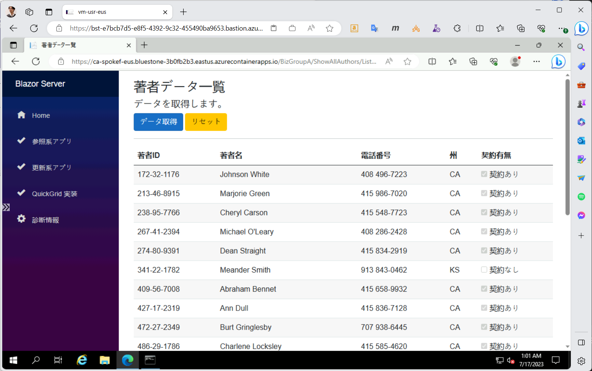
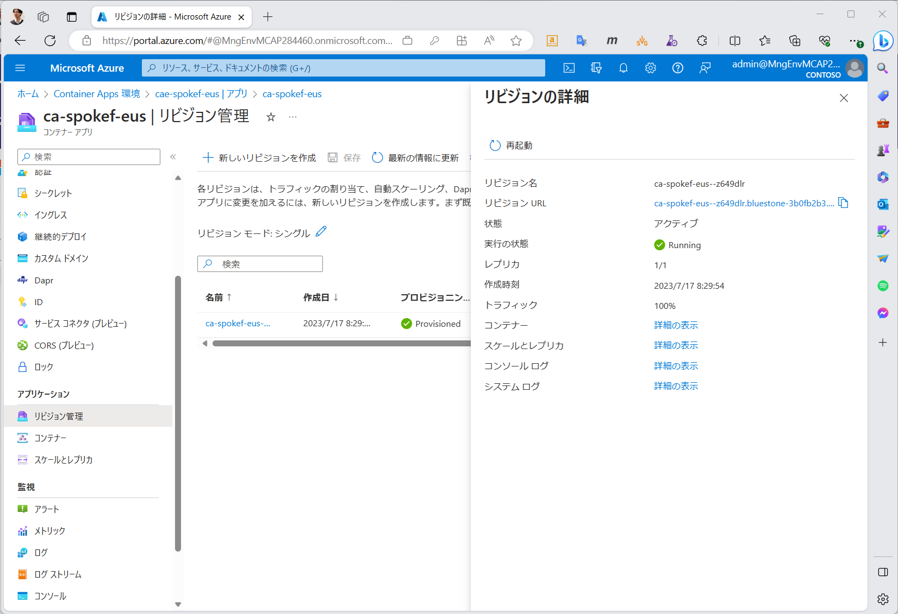
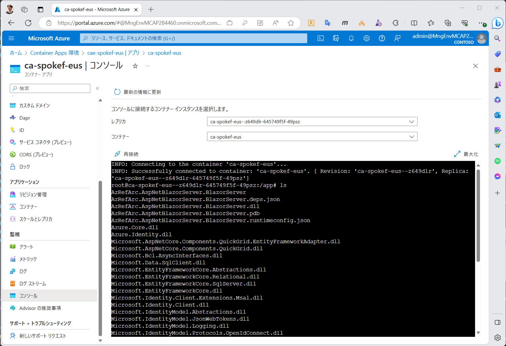
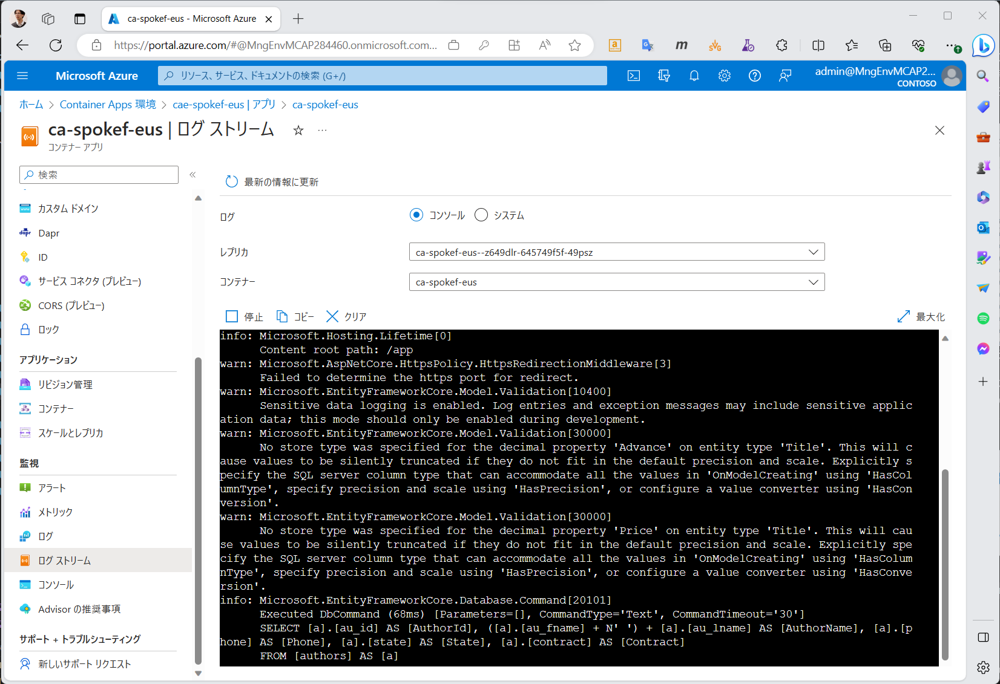

# CA の稼働確認

プッシュ後、Hub 側に設置したテスト端末（vm-usr-XXX）からアクセスを試みてください。

- アクセスに利用する FQDN 名は、下に示すスクリプトにより取得することができます。

```bash

if ${FLAG_USE_SOD} ; then az account clear ; az login -u "user_spokef_dev@${PRIMARY_DOMAIN_NAME}" -p "${ADMIN_PASSWORD}" ; fi
# Spoke F サブスクリプションで作業
az account set -s "${SUBSCRIPTION_ID_SPOKE_F}"

for i in ${VDC_NUMBERS}; do
TEMP_LOCATION_NAME=${LOCATION_NAMES[$i]}
TEMP_LOCATION_PREFIX=${LOCATION_PREFIXS[$i]}

TEMP_RG_NAME="rg-spokef-${TEMP_LOCATION_PREFIX}"
TEMP_CAE_NAME="cae-spokef-${TEMP_LOCATION_PREFIX}"
TEMP_CA_NAME="ca-spokef-${TEMP_LOCATION_PREFIX}"

TEMP_CAE_DEFAULT_DOMAIN=$(az containerapp env show --name ${TEMP_CAE_NAME} --resource-group ${TEMP_RG_NAME} --query properties.defaultDomain -o tsv)

cat <<EOF
# 以下の URL に本番系 NW（Hub 側）の端末からアクセスを試みてください。
https://${TEMP_CA_NAME}.${TEMP_CAE_DEFAULT_DOMAIN}/
EOF

done # TEMP_LOCATION

```

- Hub 側にユーザテスト端末を作成していない場合には、以下のスクリプトを使って立ててください。
  - [03_03_（オプション）ユーザ VM の作成](../03.ハブサブスクリプションの作成/03_03_（オプション）ユーザVMの作成.md)
- CA は本番系 NW（Hub 側）の vnet-spokef-XXX 側にのみ接続されています。このため、運用系 NW（ops 側）の管理端末からはアクセスできないことに注意してください。
  - 実際にはこれだと不便な場合も多いと思いますので、vnet-spokefmtn-XXX から vnet-spokef-XXX への VNET ピアリングを行うなどの工夫をしていただいてよいと思います。
  - ただし注意点として、その場合は名前解決の方法について検討してください。（CAE の IP アドレスは本番系 NW のものであるため、ops 側の IP アドレス全体を管理している fw-ops-XXX に対して DNS エントリを設定するべきではありません。例えば vm-mtn-XXX の hosts ファイルを使うなど、例外的な方法を使うことをオススメします。）
- CAE は従量課金プランを利用しています。このため、初回呼び出しにはやや時間がかかります。（10～20sec 程度）
  - ASP.NET Blazor は比較的高速な起動ができるため、コンテナの起動が 10～20sec 程度で済みますが、Java Spring Boot などコンテナの起動に非常に時間がかかるものもあります。このような場合（コンテナ起動時間が問題になる場合）には、従量課金プランではなくサーバ占有型プランを利用し、コンテナを常時起動しておくようにしてください。

  

- Azure Portal からコンテナアプリを確認すると、アプリ配置に伴ってリビジョンが自動作成されていることが確認できます。個々のリビジョンに対して個別の FQDN が作成されるため、個別 FQDN を利用して特定のリビジョンに直接アクセスすることも可能です。

  

- コンソール機能を利用すると、各コンテナインスタンスに対して直接ログインし、シェルを使って内部を確認することができます。障害解析などを行いたい場合に便利です。（この機能は Azure Portal から利用することができ、Azure Portal へアクセスできれば利用することができます。CA/CAE のエンドポイントへの通信経路は不要です。）

  

- コンソールに出力されているログは、ログストリーム画面から簡単に確認することができます。
  - また、リソース診断設定が行われていれば、このログは Log Analytics Workspace のテーブル（ContainerAppConsoleLogs）へも自動転送されています。
  - 詳細は [docs](https://learn.microsoft.com/ja-jp/azure/container-apps/log-monitoring?tabs=bash) を参照してください。

  
