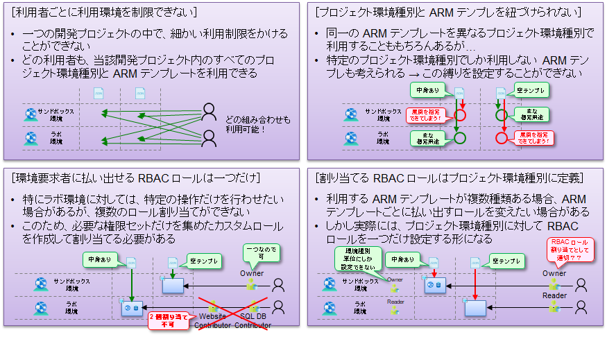

# 配置環境の作成について

配置環境（Deployment Environments）は、事前定義されたカタログ（ARM テンプレート）を開発者からの要求に基づいて自動展開し、要求者に利用してもらう機能です。

  

## 配置環境の仕組み

配置環境では、1 つの環境作成要求に対して 1 つのリソースグループが作成され、そこに指定された ARM テンプレートが展開されます。すなわち、**1 環境＝ 1 リソースグループ**です。

- 1 人が複数の環境作成を要求することはできますが、1 つの環境作成要求で、複数のリソースグループを作成するとはできません。
- リソースグループ名は、**プロジェクト環境種別名 + ユーザが指定した名前**、になります。（この名前が当該サブスクリプション内で一意である必要があります）

## 配置環境の利用に必要な作業

配置環境を利用できるようにするためには、おおまかに以下の作業が必要です。

- DevCenter での作業
  - 環境種別（DevCenter 環境種別）の定義
  - ARM テンプレートカタログの作成と取り込み
- 開発プロジェクトでの作業
  - 利用可能な環境種別（プロジェクト環境種別）の指定

## 配置環境を学習する際に注意すべき点・設計制約

以降の説明を読んでいく際の注意点として、**環境種別(Environment Types)には、DevCenter 環境種別とプロジェクト環境種別の 2 種類がある**、ということを意識しておいてください。製品ドキュメントやポータルサイト上、単に「環境種別」と書かれていることがあり、どちらのことを言っているのか判断が必要になる場合があります。

- DevCenter 環境種別とは、当該 DevCenter で利用する環境の「名前」を事前に定義しておくもの
  - **「名前」だけしか定義されていない**、というのがポイントです。他の情報は特に持っていません。
- プロジェクト環境種別とは、当該開発プロジェクトで利用できる環境と、それに付随する情報を管理するもの
  - 展開先となるサブスクリプションや、要求者に与える権限などが定義されています。
  - 利用可能な「名前」は、DevCenter 環境種別として定義されている一覧からしか選べません。

また上図に示したように、Deployment Environments では複数の ARM テンプレートと複数のプロジェクト環境種別を利用することができますが、**細かな利用可否制御ができません**（同一開発プロジェクトに参画するすべてのユーザが、すべての ARM テンプレートとすべてのプロジェクト環境種別を利用できてしまう）。主な制約事項を下記に示しますが、原則として**シンプルな使い方で設計すること**が必要です。本サンプルデモでは、以下のような方針で配置環境を構築します。詳細は関連ドキュメントを参照してください。

- 空、及びサンプルを含んだ複数の ARM テンプレートを用意する
- プロジェクト配置環境は単一（Sandbox のみ）とし、利用者には Owner 権限を払い出す

  
