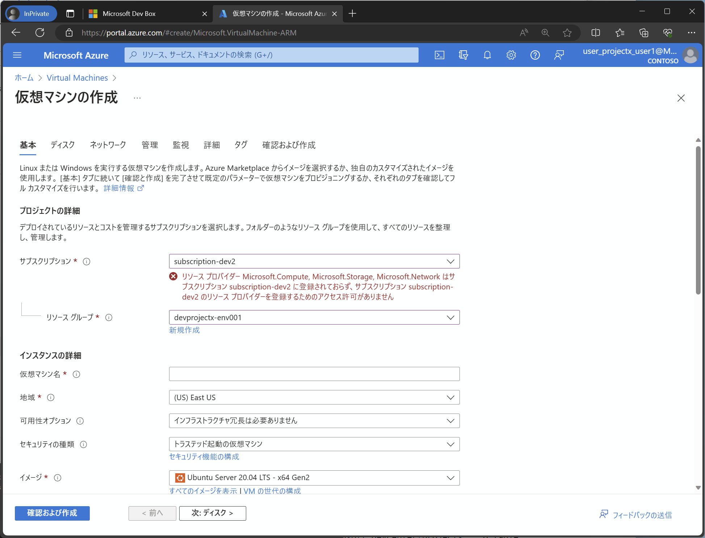
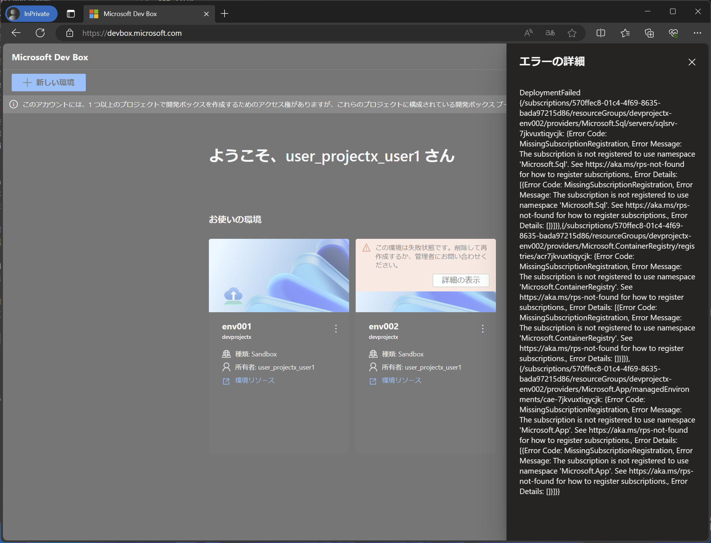
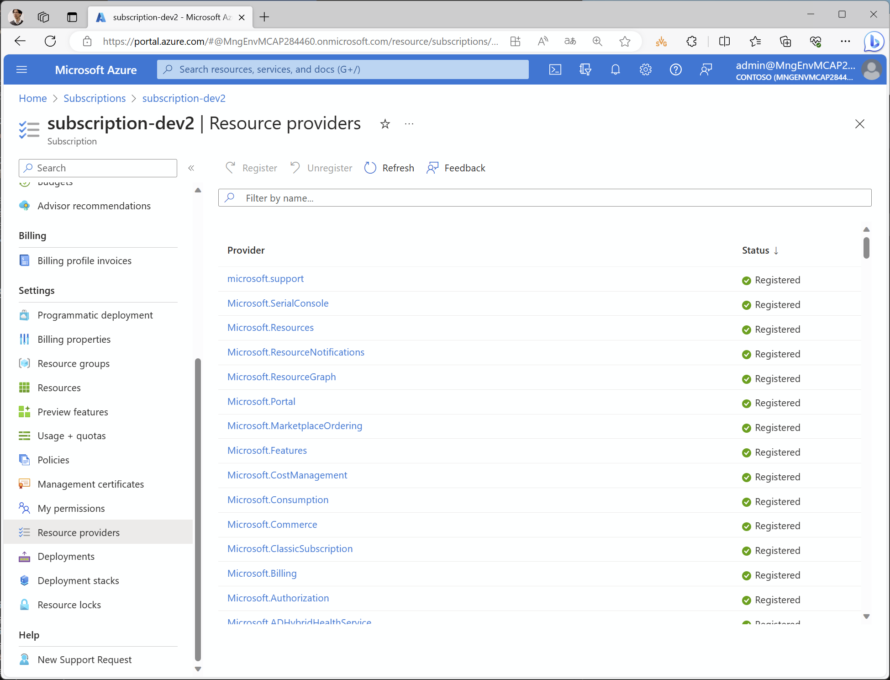

# リソースプロバイダによるリソース作成の許可・制限

先の例では空の ARM テンプレートを展開したために空のリソースグループが作成されましたが、ここに新規に Azure リソースを作成する場合、あるいはもともと中身のある ARM テンプレートを使って環境を作成する場合には、以下のポイントに注意が必要です。

- 環境展開先のサブスクリプションのリソースプロバイダが登録されていない場合、当該リソースが作成できない。
  - 例えば、配置環境に Azure SQL Database を作成する場合には、当該サブスクリプションに Microsoft.Sql リソースプロバイダが登録されている必要があります。VM の作成であれば、Microsoft.Compute, Microsoft.Storage, Microsoft.Network などのリソースプロバイダが登録されている必要があります。
  - 通常の作業時は、作業アカウントがサブスクリプションに対するリソースプロバイダ登録権限を持っているため、この登録が自動で行われます。しかし配置環境を利用する場合は、ARM テンプレートの展開作業を行うプロジェクト配置種別 MID も、あるいは環境要求者も、サブスクリプションに対するリソースプロバイダ登録権限を持っていません。
  - このため、環境展開先のサブスクリプションに対して、あらかじめ必要なリソースプロバイダを登録しておく必要があります。（同様のものに Preview Feature があります。）
- サブスクリプションのクォータ制限を受ける。
  - サブスクリプションには、リソースの作成数やサイズなどの制限が設定されています。配置環境は一つのサブスクリプションに複数作成されるため、複数環境の各種リソースの合計数がこのクォータ制限にひっかかると、当該リソースの作成ができなくなります。

逆の視点で言えば、

- 管理者がリソースプロバイダ登録を行わないことで、当該リソースの利用を禁止することができます。
- クォータ制限を適切に設定することで、環境の全体コストが無尽蔵に膨れるのを抑えることができます。

## リソースプロバイダの登録

リソースプロバイダ（及び preview feature）は、サブスクリプションの Owner 権限を持つアカウントで、以下のコマンドを実行することで登録できます。DevCenter 管理者などのアカウントには dev2 サブスクリプションの Owner 権限を付与していませんので、ここでは admin アカウントで作業を行っています。（必要に応じて、DevCenter 管理者などのアカウントに権限を付与して権限移譲してください。）

```bash

# az login コマンドで管理者権限を付与
az login

```

```bash

az account set -s "${SUBSCRIPTION_ID_DEV2}"

# 登録する Resource Provider と feature を設定
TEMP_RP_NAMES="\
Microsoft.Compute
Microsoft.Storage
Microsoft.Network
Microsoft.Web
Microsoft.Sql
Microsoft.App
Microsoft.ContainerRegistry
"
TEMP_FEATURE_NAMES="\
"
 
# RP 有効化
for TEMP_RP_NAME in $TEMP_RP_NAMES; do
az provider register --namespace "${TEMP_RP_NAME}"
done #TEMP_RP_NAME

# Feature 有効化
for TEMP_FEATURE_NAME_TEMP in $TEMP_FEATURE_NAMES; do
  # 分解して利用
  TEMP=(${TEMP_FEATURE_NAME_TEMP//,/ })
  TEMP_FEATURE_NAMESPACE=${TEMP[0]}
  TEMP_FEATURE_NAME=${TEMP[1]}
az feature register --namespace ${TEMP_FEATURE_NAMESPACE} --name ${TEMP_FEATURE_NAME}
done #TEMP_FEATURE_NAME_TEMP

# RP 有効化待ち
for TEMP_RP_NAME in $TEMP_RP_NAMES; do
while true
do
  STATUS=$(az provider show --namespace "${TEMP_RP_NAME}" --query registrationState -o tsv)
  echo "Registering Resource Provider ${TEMP_RP_NAME} is ${STATUS} ..."
  if [ "$STATUS" == "Registered" ]; then
    break
  fi
  sleep 10
done
done #TEMP_RP_NAME

# Feature 有効化待ち
for TEMP_FEATURE_NAME_TEMP in $TEMP_FEATURE_NAMES; do
  # 分解して利用
  TEMP=(${TEMP_FEATURE_NAME_TEMP//,/ })
  TEMP_FEATURE_NAMESPACE=${TEMP[0]}
  TEMP_FEATURE_NAME=${TEMP[1]}
while true
do
  STATUS=$(az feature show --namespace ${TEMP_FEATURE_NAMESPACE} --name ${TEMP_FEATURE_NAME} --query properties.state -o tsv)
  echo "Registering Feature ${TEMP_FEATURE_NAMESPACE}/${TEMP_FEATURE_NAME} is ${STATUS} ..."
  if [ "$STATUS" == "Registered" ]; then
    break
  fi
  sleep 10
done
done #TEMP_FEATURE_NAME_TEMP

```

すべてのリソースプロバイダを一括登録する場合には、以下を利用します。

```bash

# 全部まとめて登録する場合には、
TEMP_RP_NAMES=$(az provider list --query [].namespace -o tsv)

# RP 有効化
for TEMP_RP_NAME in $TEMP_RP_NAMES; do
az provider register --namespace "${TEMP_RP_NAME}"
done #TEMP_RP_NAME

# RP 有効化待ち
for TEMP_RP_NAME in $TEMP_RP_NAMES; do
while true
do
  STATUS=$(az provider show --namespace "${TEMP_RP_NAME}" --query registrationState -o tsv)
  echo "Registering Resource Provider ${TEMP_RP_NAME} is ${STATUS} ..."
  if [ "$STATUS" == "Registered" ]; then
    break
  fi
  sleep 10
done
done #TEMP_RP_NAME

```

## （参考）スクリーンショット

リソースプロバイダ登録漏れによりリソースが作成できなかった場合のエラー例

  

  

リソースプロバイダの一覧

  
